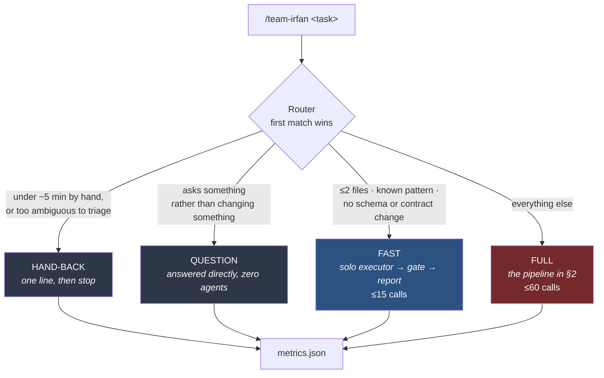
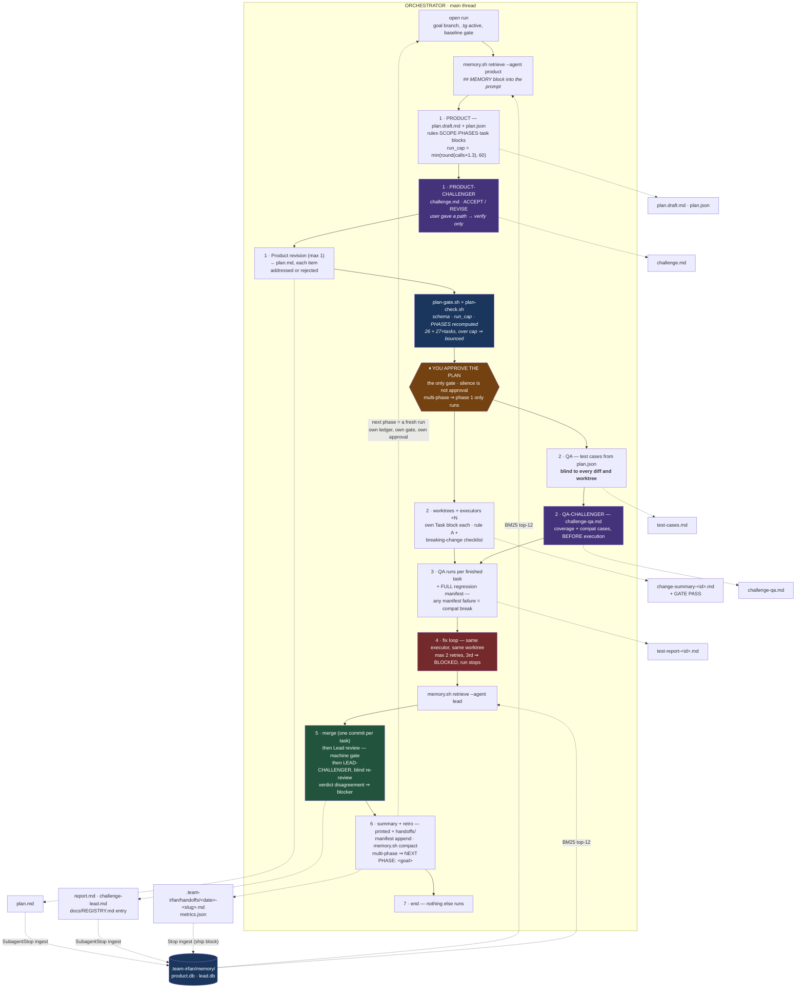
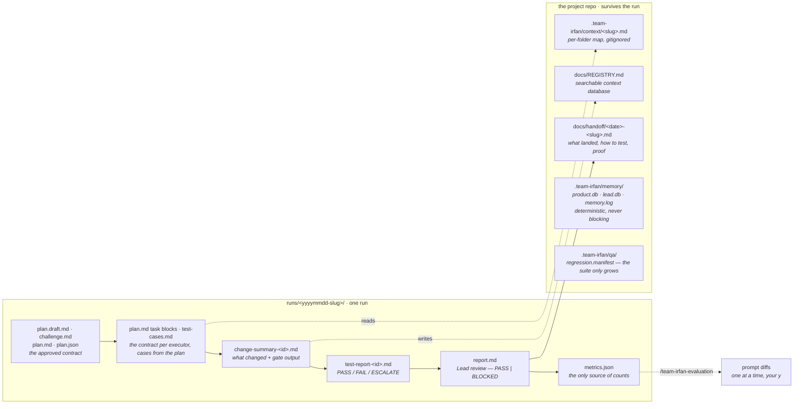
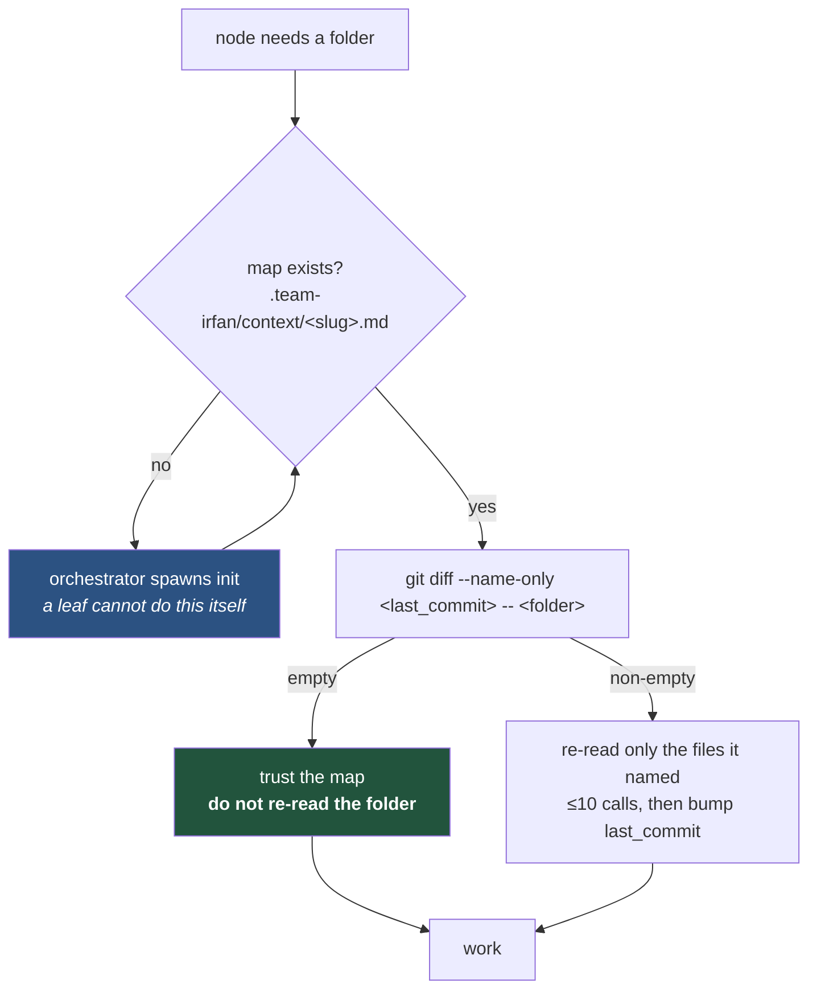
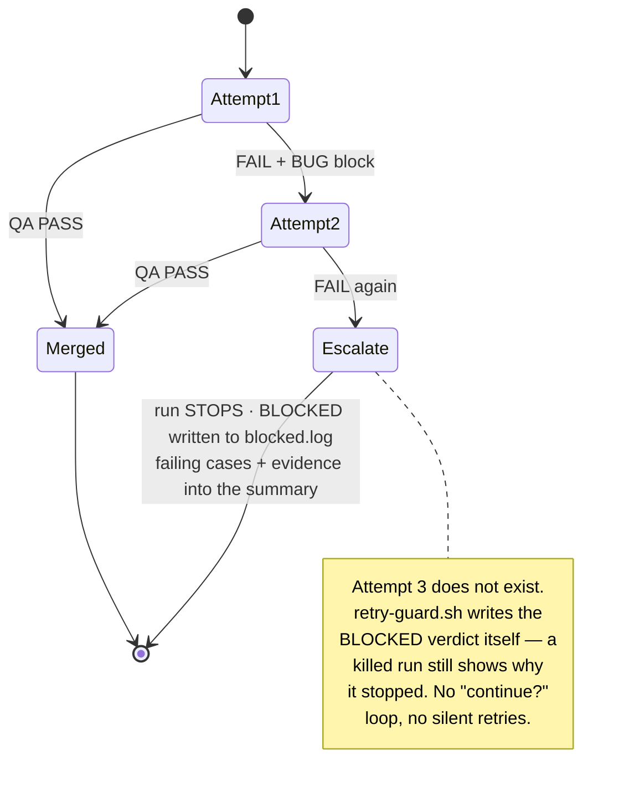
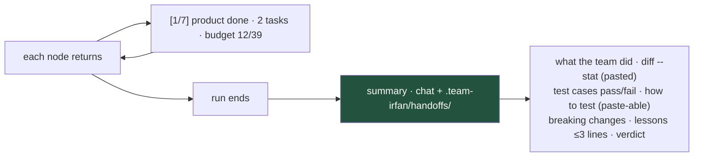
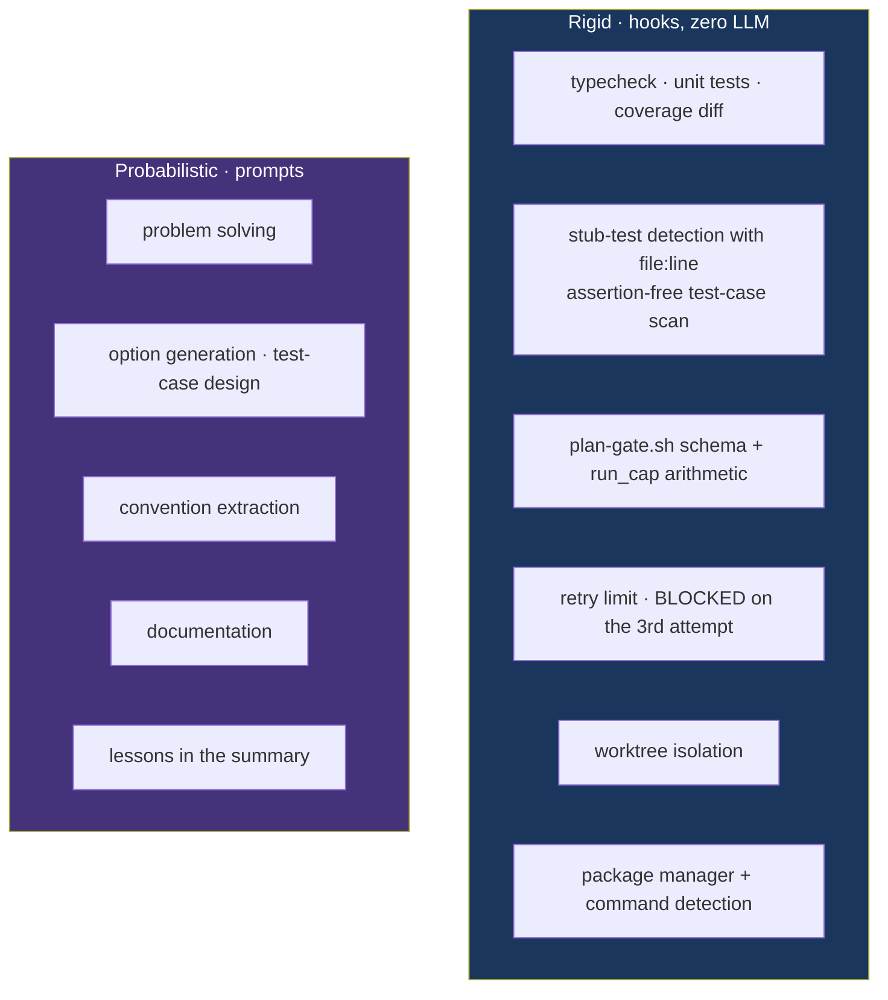
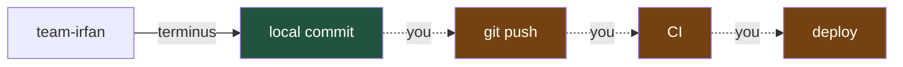

# How team-irfan works

A visual walkthrough of the graph: how a task is triaged, who runs, where state
lives, and where you are asked to decide.

Every diagram below renders on GitHub. If you are reading this in a terminal,
the tables and the ASCII pipeline in the [README](../README.md#the-full-pipeline--7-steps-one-human-gate)
carry the same information.

---

## 1. Triage — one command, four outcomes

The router is the only node that decides what happens. It reads, it does not
write, and it prints the route before doing anything else. First match wins.

**Tiebreaks are deliberately asymmetric.** Unsure between FAST and FULL → FULL,
because a wrongly-FAST task skips the human scope gate. Unsure between HAND-BACK
and FAST → HAND-BACK, because your five minutes beat fifteen tool calls.

**HAND-BACK and QUESTION still write `metrics.json`.** A route that did not run
is the one the evaluation node most needs to see: a hand-back rate near zero
means the router is not handing back, and that failure is invisible because
every run still looks successful.

---

## 2. The FULL pipeline — 7 steps, one human gate

Topology is a **star, not a chain**. The orchestrator runs in the main thread and
is the only context with a channel to you. Every other node is a leaf: one
artifact in, one artifact out, spawns nothing.

That is not a style choice. This pipeline has exactly ONE hard human gate — the
plan approval — and a subagent cannot stop and ask; a gate held by a leaf
silently degrades into an assumption with a checkbox.

### Who owns what

| | orchestrator | leaf nodes |
|---|---|---|
| talks to you | ✅ the plan gate | ❌ no channel exists |
| git operations | ✅ branch, worktree, merge, commit | ❌ except commits inside their own worktree |
| spawns agents | ✅ the only one | ❌ never |
| budget ledger | ✅ reads it (hook writes it) | counted by the hook |
| decides scope | ❌ asks you | Product proposes, challenger contests, plan-gate + plan-check verify, you approve |
| ships | ❌ | Lead's review verdict is the ship gate — PASS or BLOCKED |

---

## 3. Where state lives

**No agent remembers anything.** Kill any node mid-run and the next one picks up
from disk. This is what makes the star topology survivable.

`metrics.json` is command-written and structured. `report.md` and the summary
are prose written by nodes. **The evaluation node takes counts only from
`metrics.json`** — a number that came from a sentence is not a number.

---

## 4. Context loading — why repeat runs are cheap

Agents read **context maps, not folders**. The map is generated once per folder
and then validated with one `git diff` per run.

**Map generation belongs to the orchestrator, not the node that noticed.** Every
node is a leaf and cannot spawn `init`; a map left to "whoever touches it first"
is a map that never gets written. A run whose `metrics.json` reads
`context_maps_used: none` did exactly that, and paid for it by re-reading every
folder cold in every node.

Reading outside the in-scope folders is a forbidden action. The escape hatch is
`docs/REGISTRY.md`, grepped by `FEAT:` / `MOD:` tag — never `cat`.

---

## 5. Failure handling — bounded, never a loop

The same bound applies to Lead's review: **max 2 rounds**, then verdict BLOCKED
and the run stops. That cap wins over any "keep iterating" instruction.

The retry counter is a hook (`hooks/retry-guard.sh`), not a prompt — a node
cannot talk its way past it.

---

## 6. The budget model

Tool calls, not tokens, not minutes. The hook keeps the ledger; the
orchestrator reads it.

- **Until the plan is approved:** the static cap, 60.
- **From approval:** the plan's own `run_cap = min(round(chosen option's
  expected_calls × 1.3), 60)` — computed by Product, verified by `plan-gate.sh` (and `plan-check.sh` recomputing every phase projection, 26 + 27×tasks),
  read by `ledger.sh cap <run>` (fallback 60 when plan.json is absent).

The projection is in the plan itself — each option carries `expected_calls` —
so the cap is set with the number visible at the gate, not discovered at call
150. Before EVERY spawn: `ledger.sh read` vs `ledger.sh cap`; at or over, the
run stops with a partial summary. The cap moves only on an explicit number
from you (`cap-raised:<n>`).

**Wall clock is measured, not capped.** Executors stamp start and end and report
elapsed minutes; over 15 they must say why. There is no hard abort — an agent
cannot watch a clock while a tool call is in flight, and a prompt that claims to
enforce a timeout is theatre.

---

## 7. What reaches you

Two moments of contact: the plan (printed in full, then one approval question
with no plan content) and the summary at the end. One progress line per node in
between. The summary's test commands are literal paste-able strings, and the
diff --stat is pasted, never summarised. After the summary the session ends —
step 7 is END, nothing else runs.

---

## 8. Rigid vs probabilistic

A deterministic check is never handed to a prompt. A prompt never replaces a
deterministic check.

This is why `/team-irfan init` is split in two: `hooks/init-scaffold.sh` detects
the package manager and copies the commands verbatim from `package.json` — facts
in a file — and the agent fills only Purpose, Key files, and Conventions, which
need reading code.

---

## 9. Safety boundary

Every node carries an identical forbidden-actions block: no push, no deploy, no
CI trigger or bypass, no reading or writing `.env*` or secrets, no destructive
migration, no publish, no editing outside declared scope.

**A green `gate.sh` is a local signal, not permission to skip CI.** CI stays the
final gate.

---

## See also

- [README](../README.md) — install, usage, the efficiency contract
- [`agents/`](../agents/) — the prompt files themselves; each one is the contract for that node
- [`skills/guardrails/SKILL.md`](../skills/guardrails/SKILL.md) — the engineering rules every node obeys
- [`docs/evaluations/`](evaluations/) — what past runs measured, and what was changed because of it
- [CHANGELOG](../CHANGELOG.md) — what changed in each version of this workflow
