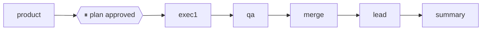

# Summary — <feature>

run: <yyyymmdd-slug>

## What the team did

<one line per node that ran.>

- product: <line>
- exec-1: <line>
- qa: <line>
- lead (review): <line>

## Changes

```
<git diff --stat <base>..HEAD — pasted, verbatim>
```

## Test cases

<pass/fail counts per task, from the test reports.>

| Task | Cases | Pass | Fail |
|---|---|---|---|
| T1 | 4 | 4 | 0 |

## How to test

<paste-able commands, the literal strings.>

```bash
curl -s -i http://127.0.0.1:3000/api/thing
```

## Breaking changes

<explicit list, or "none".>

## Lessons

<max 3 lines. this replaces the retro.>

## What ran



**Verdict:** shipped | partial | blocked — <one line>

NEXT PHASE: <the next phase's goal from the plan's PHASES block — multi-phase
runs only; single-phase runs omit this line>

